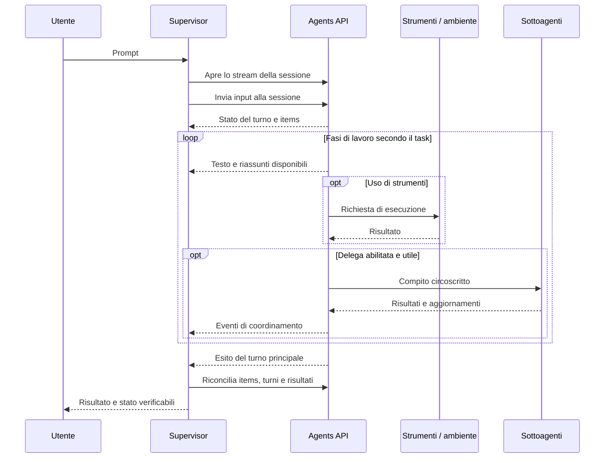

# Agents API di OpenAI: studio per Supervisor

Verificato l'11 settembre 2026 su documentazione ufficiale e sorgente locale.
Il [changelog OpenAI](https://developers.openai.com/api/docs/changelog) colloca il rilascio in **beta pubblica al 10 settembre 2026**.

## Decisione proposta

Le Agents API sono pertinenti a Supervisor: offrono il harness Codex gestito da OpenAI, con sessioni persistenti, delega, strumenti, compattazione del contesto e recupero del lavoro. La proposta è aggiungerle come **provider cloud opzionale**, mantenendo il provider Codex App Server per il lavoro desktop e i suoi controlli nativi. È una scelta progettuale derivata dal confronto, non una prescrizione di OpenAI. [Panoramica ufficiale](https://developers.openai.com/api/docs/guides/agents-api/overview).

Il primo caso utile è un revisore remoto: riceve materiali selezionati, assegna analisi indipendenti a pochi sottoagenti e restituisce un risultato verificabile. Una seconda applicazione è la produzione di documenti e report in un sandbox gestito. L'accesso al progetto Windows richiede invece un'integrazione ulteriore dell'ambiente e degli strumenti.

Questo lavoro consegna lo studio e il piano. Le copie delle fonti usate durante lo studio restano riferimenti locali e sono escluse dalla pubblicazione. Non costituisce un'implementazione del provider né una certificazione mediante chiamate API reali.

## Documentazione consultata

- [Documentazione ufficiale](https://developers.openai.com/api/docs/guides/agents-api/overview): lo studio originale ha consultato 82 documenti.
- Copertura: 30 guide Agents API, incluse le 9 integrazioni sandbox; 44 pagine di riferimento con endpoint, schemi espansi ed eventi; 8 documenti di contesto.
- [Indice ufficiale delle fonti](https://developers.openai.com/api/docs/llms.txt).
- [Piano di integrazione](OPENAI_AGENTS_API_INTEGRATION_PLAN.md): componenti, contratto, priorità e prove di accettazione.
- Copia privata facoltativa: `node scripts/sync-openai-agents-docs.mjs` scarica in `target/reference-docs/`, esclusa da Git e dalla pubblicazione.

I file ufficiali sono scaricati nella forma Markdown originale, senza traduzione o riscrittura. La copertura del riferimento segue la navigazione ufficiale TypeScript; non vengono duplicate le versioni equivalenti negli altri linguaggi. Le immagini restano collegate online. Le guide conservano gli esempi nei linguaggi presenti nel documento originale.

## Quale tecnologia fa cosa

| Soluzione | Chi gestisce il ciclo agente | Ruolo in Supervisor |
| --- | --- | --- |
| Codex App Server attuale | Processo Codex locale, protocollo nativo | Lavoro sul desktop, cronologia locale, fork e controlli già implementati |
| Agents API | Harness Codex nel servizio OpenAI | Nuove sessioni cloud durevoli e coordinamento gestito |
| Agents SDK | Runner integrato nell'applicazione | Alternativa quando vogliamo possedere orchestrazione, storage e integrazioni |
| Responses API, anche Multi-agent | Integrazione delle risposte e degli strumenti controllata dall'app; collaborazione gestita dove configurata | Alternativa per controllo più fine, con maggiore lavoro applicativo |

OpenAI distingue esplicitamente questi runtime. Un SDK session, una Agents API session, una Responses conversation e un sandbox sono risorse diverse. [Confronto ufficiale](https://developers.openai.com/api/docs/guides/agents).

Anche **Responses Multi-agent** e **Agents API Multi-agent** hanno contratti diversi: il primo permette function call dai diversi agenti; le Agents API attuali non supportano function tools nei sottoagenti. Non trasferire automaticamente configurazione, default o parser da un protocollo all'altro. [Responses Multi-agent](https://developers.openai.com/api/docs/guides/responses-multi-agent), [Agents API Multi-agent](https://developers.openai.com/api/docs/guides/agents-api/multi-agent).

## Risorse e capacità

| Risorsa o capacità | Funzione | Applicazione concreta |
| --- | --- | --- |
| Agent salvato | Configurazione riutilizzabile di modello, istruzioni e strumenti | Profili revisore, sviluppatore e coordinatore |
| Session | Conversazione e lavoro durevoli | Un collegamento persistente tra task Supervisor e `session_id` |
| Turn | Una fase di lavoro con stato, esito e consumo | Distinguere invio, esecuzione, attesa, completamento e fallimento |
| Items | Messaggi e chiamate salvati | Cronologia ricostruibile all'avvio e dopo una disconnessione |
| Stream eventi | Aggiornamenti in diretta | Testo, riassunti del reasoning, strumenti e attività delegata |
| Multi-agent | Il coordinatore crea e gestisce sottoagenti | Analisi parallele con contesti distinti e risultato riunito |
| Environment | Compute e file opzionali | Nessun ambiente, sandbox OpenAI oppure ambiente proprio |
| Function tools | Chiamate eseguite dal codice dell'app | Funzioni del coordinatore con controlli applicativi |
| MCP | Strumenti raggiunti dal servizio o dall'ambiente | Accesso a dati e azioni, anche per sottoagenti |
| Skills e plugin | Istruzioni e configurazioni riutilizzabili | Procedure di verifica e convenzioni del progetto |
| Vault | Credenziali riutilizzabili per MCP collegati dal servizio | Connessioni autenticate separate dalla configurazione dell'agente |
| Artifacts | Copie pubblicate di output del sandbox OpenAI | Download di report e altri risultati versionati per turno |
| Webhook e usage | Cambiamenti di stato e consumi registrati | Lavori remoti, notifiche e stime di costo |

Fonti: [configurazione](https://developers.openai.com/api/docs/guides/agents-api/configuration), [architettura](https://developers.openai.com/api/docs/guides/agents-api/architecture), [eventi](https://developers.openai.com/api/docs/guides/agents-api/sessions/events), [riferimento API locale](https://developers.openai.com/api/docs/guides/agents-api/overview).

## Conversazione: la sequenza corretta

Un turno può contenere più chiamate al modello e agli strumenti. Riassunti del reasoning, testo e attività dei sottoagenti possono alternarsi. Non esiste una sequenza obbligatoria del tipo “tutto il reasoning, poi tutti gli strumenti, poi la risposta”. La UI deve seguire identità e stati del protocollo. [Tracing](https://developers.openai.com/api/docs/guides/agents-api/tracing), [eventi e items](https://developers.openai.com/api/docs/guides/agents-api/sessions/events).

Il diagramma rappresenta le dipendenze logiche. Non impone un ordine globale agli eventi concorrenti. Una function tool passa da Supervisor; un MCP può essere chiamato direttamente dal servizio o dall'executor.

1. Salvare l'identità locale del task e il relativo `session_id`. Per la prima creazione, `stream: true` permette di seguire il turno iniziale nella stessa richiesta; con `environment.type: "none"` serve l'input iniziale.
2. Nei messaggi successivi, aprire lo stream **prima** di inviare `agent.session.input.message`. Su una sessione idle parte un turno; durante un turno il messaggio serve a indirizzare il lavoro in corso. Gestire anche il rifiuto `active_turn_not_steerable`.
3. L'esito HTTP dell'invio non prova che il lavoro sia terminato. Le operazioni di invio eventi non restituiscono una risposta finale dell'agente.
4. Correlare testo mediante `item_id`, `output_index` e `content_index`. `output_text.done` sostituisce il buffer con il testo completo: i delta possono mancare.
5. Per il reasoning usare gli eventi pubblici `reasoning_summary_part.*` e `reasoning_summary_text.*`, distinti per `summary_index`. Mostrare soltanto i riassunti esposti; contenuto cifrato e ragionamento interno non sono una trascrizione leggibile da ricostruire.
6. Quando arriva `requires_action`, leggere lo stato autorevole e le azioni pendenti. L'esistenza di una vecchia chiamata nella cronologia non autorizza a eseguirla di nuovo.
7. Completamento, fallimento o cancellazione del **turno principale** determinano l'esito mostrato. La fine di un sottoagente non conclude il coordinatore; `session.idle` e chiusura dello stream non provano il successo.

Contratti consultati: [invio degli eventi](https://developers.openai.com/api/reference/typescript/resources/beta/subresources/agents/subresources/sessions/subresources/events/methods/create), [eventi pubblici](https://developers.openai.com/api/reference/resources/beta/subresources/agents/streaming-events), [turni](https://developers.openai.com/api/reference/typescript/resources/beta/subresources/agents/subresources/sessions/subresources/turns/methods/retrieve).

## Recupero della cronologia e degli invii

Gli stream sono live: **non effettuano replay degli eventi persi**. La procedura ufficiale è riaprire lo stream e bufferizzare, leggere sessione e items salvati, ricostruire per ID, poi applicare gli aggiornamenti bufferizzati che non riguardano items già definitivi. Recuperare tutte le pagine; per la storia dei figli usare i rispettivi endpoint. [Procedura di recupero](https://developers.openai.com/api/docs/guides/agents-api/sessions/events#how-to-recover-a-disconnected-stream).

L'invio messaggi espone `idempotencyKey` come parametro header nel riferimento TypeScript. Supervisor dovrà salvare la chiave insieme all'intento prima dell'invio e riutilizzarla per lo stesso messaggio. Questo non documenta una garanzia di idempotenza per la creazione iniziale di sessioni o per ogni effetto di uno strumento. Durata e dettagli del dedup vanno verificati prima dei retry automatici. [Contratto di invio](https://developers.openai.com/api/reference/typescript/resources/beta/subresources/agents/subresources/sessions/subresources/events/methods/create).

Per function tool con effetti, conservare risultato e stato per `(session_id, turn_id, call_id)`. Dopo una perdita di connessione, controllare l'esito precedente e restituire il risultato salvato. [Recupero delle funzioni](https://developers.openai.com/api/docs/guides/agents-api/tools/functions).

## Delega, supervisione e albero

Con `multi_agent.enabled: true` il harness fornisce gli strumenti di coordinamento. Supervisor osserva le azioni e visualizza le relazioni. La documentazione raccomanda sottoattività indipendenti con un risultato atteso chiaro; i passaggi brevi o dipendenti rimangono al coordinatore. Il limite predefinito è 6 sottoagenti concorrenti, escluso il coordinatore; la proposta economica per il primo esperimento è 2. Tutti condividono il filesystem dell'unico ambiente della sessione. [Guida multi-agent](https://developers.openai.com/api/docs/guides/agents-api/multi-agent).

Per costruire l'albero usare le identità pubbliche del sottoagente, `parent_agent_id` e l'agente del turno. Lo stato `active` indica che il sottoagente è disponibile, anche mentre è idle; non equivale a “sta generando”. [Risorsa subagent](https://developers.openai.com/api/reference/typescript/resources/beta/subresources/agents/subresources/sessions/subresources/subagents/methods/retrieve).

Un **fork di una conversazione Codex**, un **sottoagente in una sessione API** e una **nuova sessione creata con lo stesso profilo** devono restare relazioni distinte. La superficie pubblica esaminata offre lettura dei sottoagenti, ma non endpoint per crearli o inviare loro direttamente un prompt: quelle azioni appartengono al harness. Le chiamate di coordinamento non garantiscono una trascrizione completa degli scambi. [Riferimento locale](https://developers.openai.com/api/docs/guides/agents-api/overview).

## Strumenti e ambienti applicati a Supervisor

Per partire basta `environment.type: "none"`: testo, ricerca web e MCP remoti. Il desktop non deve fornire un processo di esecuzione. Per produrre file, il sandbox `openai_hosted` offre Linux con Python e Node; non rappresenta il desktop Windows. [Architettura](https://developers.openai.com/api/docs/guides/agents-api/architecture), [sandbox gestito](https://developers.openai.com/api/docs/guides/agents-api/environments/openai-hosted).

Per lavorare sul compute proprio si usa **`codex exec-server`**, diverso da `codex app-server`. Riceve environment ID e remote URL restituiti dall'API e avvia connessioni in uscita. È stata verificata solo la presenza dell'opzione nella CLI locale 0.153.4, marcata experimental: nessun executor è stato avviato o registrato. La compatibilità effettiva Windows/cloud resta da provare. [Ambiente proprio](https://developers.openai.com/api/docs/guides/agents-api/environments/self-hosted).

Il MCP locale di Supervisor potrebbe essere collegato dall'ambiente mediante stdio o HTTP con `connection_origin: "environment"`, con strumenti limitati al progetto. Un URL localhost lasciato sul valore predefinito `service` si riferirebbe al contesto del servizio, non al PC. I controlli applicativi devono stare anche nel server degli strumenti: le chiamate MCP non attraversano necessariamente il pannello di approvazione della UI. [MCP](https://developers.openai.com/api/docs/guides/agents-api/tools/mcp).

I vault servono ai MCP collegati dal servizio, non a quelli HTTP collegati dall'ambiente. L'OAuth del servizio terzo rimane gestito dall'applicazione. [Vaults](https://developers.openai.com/api/docs/guides/agents-api/tools/vaults).

I plugin richiedono radici esplicite; aggiungere la directory padre non carica automaticamente ogni configurazione MCP dei plugin figli. Modifiche a plugin o template richiedono nuove sessioni. [Plugin](https://developers.openai.com/api/docs/guides/agents-api/tools/plugins).

Programmatic Tool Calling è abilitato per default nel harness: può coordinare strumenti in JavaScript e ridurre i risultati intermedi inviati al modello. Non modifica il luogo o i permessi di esecuzione degli strumenti. Tool search differisce tra functions e MCP: le functions richiedono opt-in e `defer_loading`; i MCP usano la scoperta automatica quando supportata. [PTC](https://developers.openai.com/api/docs/guides/tools-programmatic-tool-calling#agents-api), [tool search](https://developers.openai.com/api/docs/guides/tools-tool-search#agents-api).

## Limiti da rispettare nel prodotto

| Punto | Conseguenza per Supervisor |
| --- | --- |
| Sottoagenti senza function tools | Strumenti destinati ai figli tramite MCP/ambiente, oppure lavoro demandato al coordinatore |
| Session update modifica metadata | Il selettore non può promettere un cambio live di modello, reasoning o tools su una sessione esistente |
| Nessun endpoint fork/rollback/goal equivalente nella superficie esaminata | Controlli disponibili per capacità del provider; nessuna emulazione spacciata per operazione nativa |
| Trace dettagliate nel dashboard | Visualizzare eventi/items pubblici; offrire accesso al dashboard, senza usare i suoi endpoint privati |
| Usage parziale e aggiornabile | `null` significa sconosciuto; non trattare le stime come fattura o budget esatto |
| Output di comandi senza indicatore pubblico di troncamento | Non dichiarare che ogni output sia completo |
| Template e liste di tools sostituiscono interi campi negli override | Costruire configurazioni risolte, evitando merge impliciti |
| MCP stdio nel sandbox OpenAI richiede rete enabled | Non offrire contemporaneamente quel trasporto e una policy hosted disabled/restricted |

Fonti: [session update](https://developers.openai.com/api/reference/typescript/resources/beta/subresources/agents/subresources/sessions/methods/update), [osservabilità](https://developers.openai.com/api/docs/guides/agents-api/observability), [configurazione](https://developers.openai.com/api/docs/guides/agents-api/configuration), [MCP](https://developers.openai.com/api/docs/guides/agents-api/tools/mcp).

## Account, costi e continuità

Il collegamento ChatGPT/Codex di Supervisor non è la credenziale descritta per questa API. Il quickstart richiede una chiave di progetto Platform con `api.agents.read`, `api.agents.write` e `api.responses.write`. L'executor usa una chiave distinta limitata alla connessione degli ambienti. [Prerequisiti](https://developers.openai.com/api/docs/guides/agents-api/quickstart#prerequisites), [autenticazione executor](https://developers.openai.com/api/docs/guides/agents-api/environments/self-hosted#authentication).

I consumi sono API, con eventuali costi per strumenti e container. La preferenza esistente per Luna, effort low e velocità normale si può conservare nel piano come `gpt-5.6-luna`, `reasoning.effort: "low"`, `service_tier: "default"`, verificando accesso e compatibilità nel progetto API. Presenza nel catalogo o negli enum non dimostra l'abilitazione dell'account. [Prezzi](https://developers.openai.com/api/docs/pricing), [configurazione agente](https://developers.openai.com/api/reference/typescript/resources/beta/subresources/agents/methods/create).

Le sessioni gestite conservano stato nel servizio; la documentazione attuale indica residenza dei dati negli Stati Uniti e assenza di ZDR per Agents API, anche con ambiente proprio. È un confine diverso dalla cronologia locale isolata già realizzata. [Panoramica e dati](https://developers.openai.com/api/docs/guides/agents-api/overview).

Un lavoro può proseguire con Supervisor chiuso se strumenti e ambiente necessari rimangono disponibili altrove. Una funzione eseguita dal PC o un executor arrestato possono impedirlo. Lo stream chiuso non cancella il turno. Per il compute self-hosted, cancellare la sessione e arrestare l'ambiente sono operazioni separate; `idle` da solo non è un segnale sicuro di spegnimento. [Lifecycle](https://developers.openai.com/api/docs/guides/agents-api/environments/lifecycle).

## Riscontro sul codice attuale

L'ispezione statica non ha individuato un'integrazione già esistente delle Agents API. Ha confermato elementi utili da preservare:

- `src/provider.rs`: identità persistenti dei provider, compreso `codex_app_server`.
- `crates/central-agent-codex-runtime/src/runtime.rs`: versione nativa fissata a 0.153.4 e profilo separato.
- `crates/central-agent-codex-runtime/src/mirror.rs`: proiezione per visualizzazione, riassunti distinti dal contenuto di reasoning e sostituzione con items autorevoli.
- `src/browser/app_server/event_log.rs`: registro limitato di metadata, non una cronologia da reinviare al modello.
- `src/browser/app_server/turns.rs` e `history_pages.rs`: gestione di invio e riconciliazione della cronologia.
- `crates/central-agent-codex-runtime/src/conversations/delegation.rs`: parentela basata su evidenza nativa; persistenza prima della pubblicazione della destinazione.
- `src/browser/chat_ownership.rs` e `ui/src/lib/conversation-events.ts`: appartenenza al task esplicita, indipendente dalla chat selezionata.

Questi principi sono coerenti con l'integrazione proposta. Serve un adattatore separato per il nuovo contratto HTTP/SSE; non basta rinominare gli eventi dell'App Server. Lo studio non dimostra un nuovo difetto nella catena attuale: individua differenze che una futura integrazione deve gestire.
